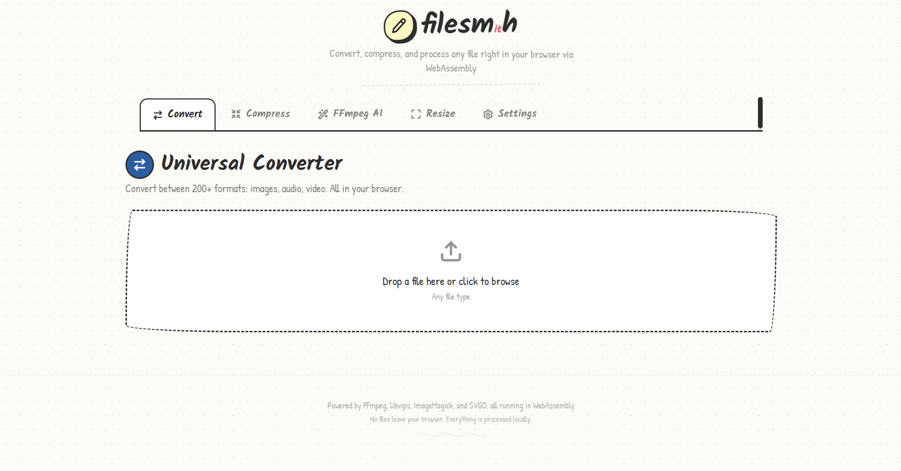
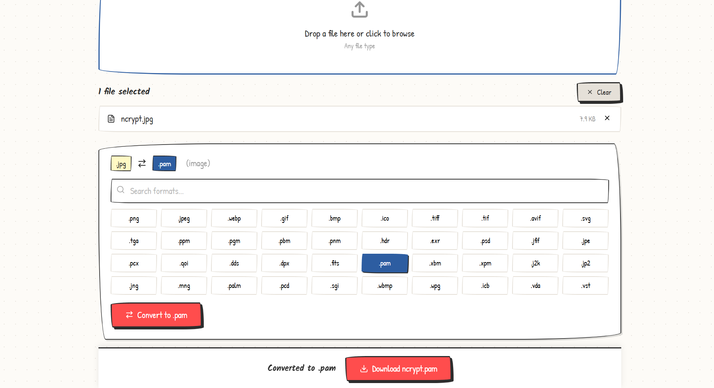
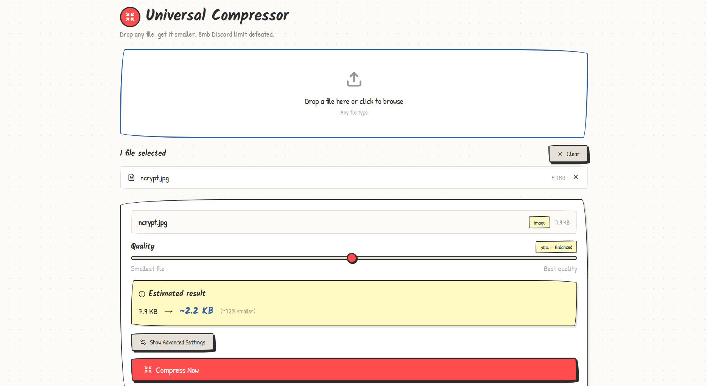
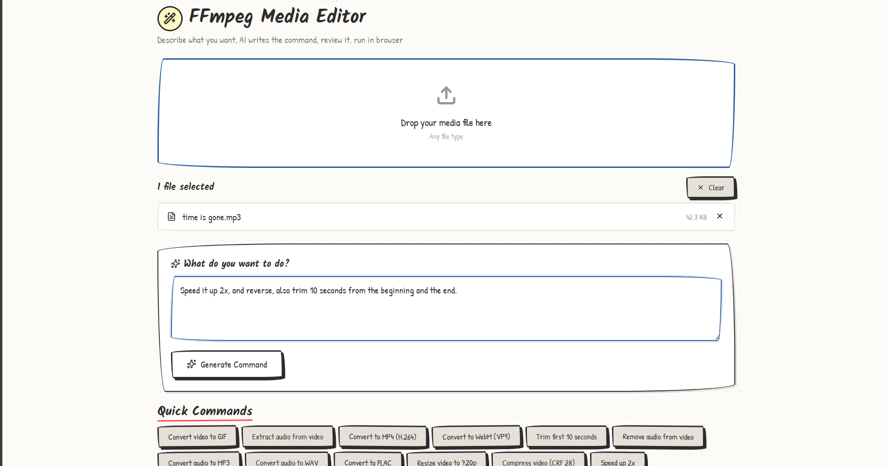
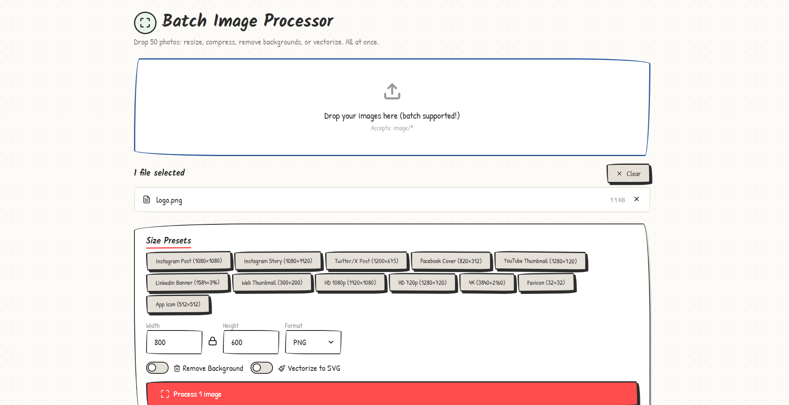

# Filesmith

Filesmith is a browser based serverless file processing toolkit using wasm: convert, compress, resize, and transform files in browser directly without uploading anything anywhere.



- multi-engine fallback: vips, imagemagick, ffmpeg, and svgo where each fits best
- privacy first: uploaded files do not leave your browser

## Core Features

### convert



- converts anything to anything (image, audio, and video files across many formats)
- uses wasm-vips first for fast image conversion, then falls back to imagemagick when needed
- uses ffmpeg compiled using wasm for audio/video

### compress



- image compression with quality control, optimization using audio and video re-encoding with codec, bitrate, and sample-rate controls, svgo for svg controls
- compression estimate and detailed processing log.

### ffmpeg



- english prompt to generate ffmpeg arguments and commands using an llm (nvidia nim provider by default)
- command preview / ability to modify and copy before execution
- presets for common actions

### batch processor



- batch resize multiple images at once
- background removal and vectorization
- exports as zip when multiple files are modified
- presets for social, web, and app icon dimensions


## Supported File Families

- images: png, jpg/jpeg, webp, gif, bmp, ico, tiff, avif, svg, and more.
- audio: mp3, wav, flac, ogg, opus, aac, m4a, and more.
- video: mp4, webm, mkv, avi, mov, wmv, and more.

exact behavior depends on browser support and memory (large files may break/crash the browser)

## Getting Started

### Prerequisites

- Node.js 18+
- npm

### install

```bash
npm install
```

### start dev server

```bash
npm run dev
```

## privacy woo

files are processed locally in the browser, only network requests are the ones made to the llm provider for ffmpeg commands.
